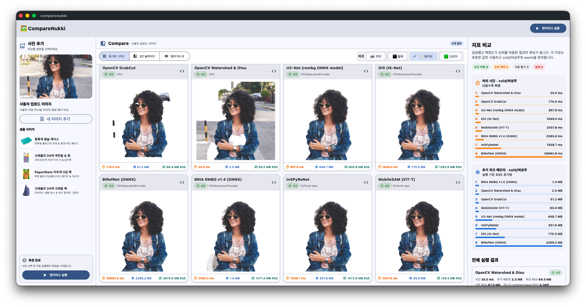

# CompareNukki



8개 배경 제거 엔진을 같은 입력과 측정 조건으로 실행하고, 결과 이미지와 실제 성능 지표를 비교하는 Flutter 데스크톱 앱입니다.

앱을 열거나 사진을 선택하는 것만으로는 연산이 시작되지 않습니다. 사용자가 **벤치마크 실행**을 누른 경우에만 Python 워커가 백그라운드 프로세스로 시작됩니다.

## 문서

- [수행 방법](usage.md): 개발 환경, 모델 설정, 앱/CLI 사용, 지표 해석과 문제 해결
- [배포 방법](deploy.md): 플랫폼별 빌드, Python·모델 프로비저닝, 서명과 릴리스 점검

## 화면 구성

- **사진 추가**: 샘플/사용자 이미지 선택, 실행·취소, 진행 상태
- **Compare**: 동기화 그리드, 2단 커튼 슬라이더, 알파 마스크, 배경 전환
- **지표 비교**: 처리 시간, 실행 중 RSS 증가량, 피크 RSS, 단계별 시간과 실행 provenance

폭 1180px 이상에서는 세 영역을 한 화면에 나란히 표시하고, 더 작은 창에서는 하단 내비게이션으로 역할을 분리합니다.

## 실행 구조

```text
사용자 실행 버튼
    ↓
Flutter BLoC ── 진행 결과 스트림 ── NukkiService
                                      ↓ NDJSON
                              상주 Python worker
                                      ↓ 순차 실행
                              8개 엔진 registry/LRU
```

- 워커는 최초 명시적 실행 때 지연 시작되고, 다음 실행에서는 모델 세션을 재사용합니다.
- 요청을 시작할 때 입력을 불변 임시 스냅샷으로 한 번 복사하고 그 바이트를 해시하므로, 같은 요청의 모든 엔진이 동일한 입력을 읽습니다.
- 무거운 모델 세션은 `NUKKI_MAX_RESIDENT_MODELS`(기본 2) 크기의 LRU로 제한합니다.
- 취소/시간 초과 시 네이티브 추론을 확실히 중단하기 위해 워커 프로세스를 종료합니다. 다음 실행에서는 새 워커가 시작됩니다.
- 결과는 엔진마다 즉시 화면에 스트리밍되며 `success`, `partial`, `failed` 완료 상태를 구분합니다.
- 요청 결과는 임시 디렉터리에 저장하고 최근 3개만 유지합니다. 앱 종료 시 이 세션에서 만든 결과를 제거하고, 7일 이상 지난 잔여 임시 결과도 정리합니다.

## 엔진

| ID | 구현 | 기본 요구 사항 |
| --- | --- | --- |
| `grabcut` | OpenCV GrabCut | OpenCV |
| `watershed` | OpenCV Otsu + Watershed | OpenCV |
| `rembg_u2net` | U2-Net ONNX | `u2net.onnx` |
| `isnet` | IS-Net ONNX | `isnet-general-use.onnx` |
| `birefnet` | BiRefNet ONNX | `birefnet-general.onnx` |
| `rmbg` | BRIA RMBG ONNX | `bria_rmbg14.onnx` |
| `inspyrenet` | `transparent-background` InSPyReNet | 패키지 + `ckpt_base.pth` |
| `mobilesam` | MobileSAM ViT-T | PyTorch, MobileSAM + `mobile_sam.pt` |

요청한 구현을 실행할 수 없을 때 다른 알고리즘으로 몰래 대체하지 않습니다. 라이브러리나 체크포인트가 없으면 해당 엔진은 `unavailable`로 표시되고 순위에서 제외됩니다.

## 측정 의미

- **처리 시간**: 이미지 로드, 모델 준비, 전처리, 추론, 후처리, 저장을 포함한 단조 시계 기반 wall time
- **추가 피크 메모리**: 실행 시작 RSS 대비 5ms 샘플링 구간의 최대 증가량
- **피크 RSS**: 같은 구간에서 관찰한 Python 워커 프로세스의 절대 최대 RSS
- **단계별 시간**: `model_load_ms`, `preprocess_ms`, `inference_ms` 등
- **cold/warm**: 모델 세션을 새로 만들었는지 상주 세션을 재사용했는지 표시

정답(GT) 마스크가 없으므로 결과 품질 순위는 만들지 않습니다. `mask_compactness`는 마스크 형상 진단값일 뿐 품질 점수가 아니며 상세 정보에만 표시합니다. 순위에는 백엔드가 `rankable=true`로 보고한 성공 결과만 포함합니다.
